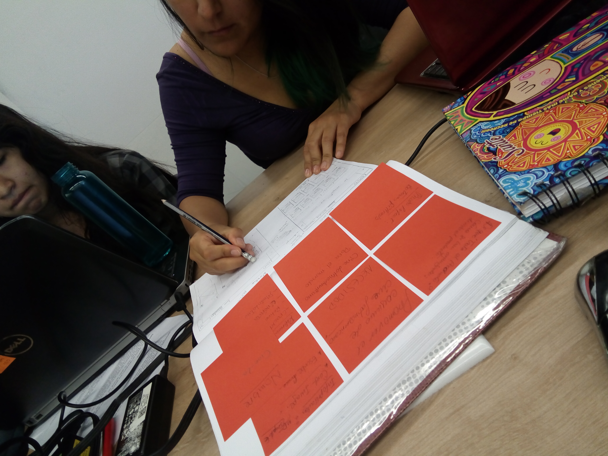

# CINE-LA

## Hackathon del Final del Common Core: 2017-II

Este producto es parte de la finalización del **Common Core** de **Laboratoria**.

### ¿De qué se trata nuestro producto?
Cine-la es una plataforma web que brinda una informaciond de peliculas y un sector para los fans de todo tipo.
### ¿Para qué sirve?
Sirve para mejor experiencia y facil busqueda de peliculas y opcion ver por varios dias una saga de lo que mas guste a fans de distintos tipos de gustos.
### ¿Cómo decidieron por ese producto / cómo validaron la idea?
Fue echo por investigaciones y cotar experiencias para poder tener un tema definido.
### ¿Cómo se organizaron / dividieron el trabajo?
#### 1. Flujo de Trabajo:
* Día 01: 16/01/17
  - Nos dieron las siguientes [instrucciones](https://bit.ly/hackathon-1).
  - En el grupo identificamos las posibles UX y las posibles FrontEnd.

  * 08am a 09am: Ideas.
  * 09am a 11am: Buscar información según especialidad.
  * 11am a 1pm: Hacer scketching y buscar información de cómo acceder a la data de la APIOMDb.

### Algunas Fotos del Proceso:

* Día 02: 17/01/17
- Hoy con mas busqueda modificamos en las ideas.
- La eleccion del logo ya esta definido.

-  Todo el dia: Nos hemos repartido por secciones el avance de maquetado entre las 4.
* 10:40: Dos chicas saldra a presentar el avance y de que trata nuestro producto.

### Algunas Fotos del Proceso:

* Día 03: 18/01/17
  - Fue terminado de repatir los maquetados para el dia de hoy estuviera listo y solo juntar.
  - Se sigue avanzando ahora en la funcionabilidad y pulir maquetado.

* Día 04: 19/01/17

### ¿Qué esperan tener para el viernes?
- Maquetación terminada.
- Cada parte de la pagina este funcional.
- Buen filtrado de la información.
### Recursos Usados:

* Páginas de referencias:

  - https://www.filminlatino.mx/
  - https://www.retinalatina.org/
  - http://www.cinepata.com/
  - http://developers.ocioavila.com/
  - http://themoviedb.org/
  - wwww.forodecine.com

### Realizado por:
* Laura Jimenez
* Noelia Tello
* Longhi Valverde
* Molly Siesquén
